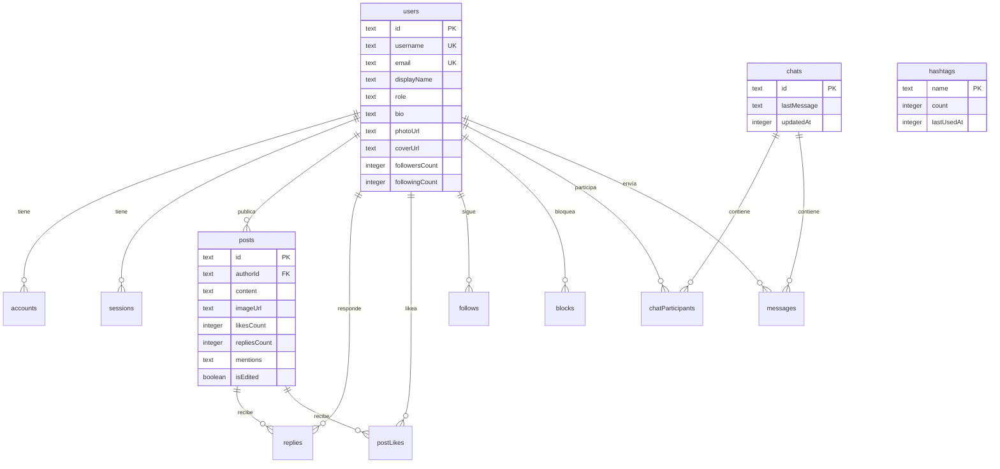

<div align="center">

# 🔥 Obey

**Donde el deseo habla.**

Una red social moderna construida con Next.js, Turso y NextAuth — diseñada para comunidades que priorizan la expresión auténtica.

[](https://nextjs.org/)
[](https://turso.tech/)
[](https://authjs.dev/)
[](https://orm.drizzle.team/)
[](https://typescriptlang.org/)

</div>

---

## 📖 Descripción

**Obey** es una plataforma social tipo microblogging con una experiencia de usuario inspirada en Twitter/X. Está construida como una Single Page Application (SPA) con navegación client-side, dark mode nativo, y una arquitectura basada en Server Actions de Next.js para operaciones de base de datos seguras.

La plataforma permite a los usuarios publicar contenido, interactuar mediante likes y respuestas, enviar mensajes directos, seguir a otros usuarios, y gestionar su perfil — todo desde una interfaz oscura, fluida y moderna.

---

## ✨ Features

### Social

| Feature | Estado | Descripción |
|---------|--------|-------------|
| **Feed (Pulse)** | ✅ | Timeline personalizado con posts de usuarios seguidos |
| **Posts** | ✅ | Crear, editar y eliminar publicaciones con texto e imágenes |
| **Respuestas** | ✅ | Sistema de replies anidado por post |
| **Likes** | ✅ | Toggle de likes con contador en tiempo real |
| **Hashtags** | ✅ | Extracción automática y tracking de tendencias |
| **Menciones** | ✅ | `@usuario` con autocompletado y resolución de IDs |
| **Tendencias** | ✅ | Widget lateral con hashtags más populares |

### Comunicación

| Feature | Estado | Descripción |
|---------|--------|-------------|
| **Mensajes Directos** | ✅ | Chat 1:1 con vista completa y widget flotante |
| **Búsqueda de usuarios** | ✅ | Buscar usuarios por username |
| **Notificaciones** | 🔲 | UI preparada, lógica pendiente |

### Usuarios

| Feature | Estado | Descripción |
|---------|--------|-------------|
| **Google OAuth** | ✅ | Login con Google via NextAuth |
| **Perfil de usuario** | ✅ | Bio, foto, cover, display name |
| **Onboarding** | ✅ | Formulario de setup inicial post-registro |
| **Follow/Unfollow** | ✅ | Sistema de seguidores con contadores |
| **Bloqueo** | ✅ | Bloquear/desbloquear usuarios, filtrado en feed |
| **Edición de username** | ✅ | Limitada a 1 cambio (anti-abuse) |
| **Cooldown de display name** | ✅ | 14 días entre cambios |

---

## 🏗️ Arquitectura

```
┌─────────────────────────────────────────────────┐
│                   Cliente (React)                │
│  ┌──────────┐ ┌──────────┐ ┌──────────────────┐ │
│  │  Feed    │ │ Profile  │ │    Messages      │ │
│  │  Posts   │ │ Settings │ │  (Full + Widget) │ │
│  └────┬─────┘ └────┬─────┘ └────────┬─────────┘ │
│       │             │                │           │
│  ┌────▼─────────────▼────────────────▼─────────┐ │
│  │           AuthContext (useAuth)              │ │
│  │    user · dbUser · blocks · follows         │ │
│  └──────────────────┬──────────────────────────┘ │
└─────────────────────┼───────────────────────────-┘
                      │  Server Actions
┌─────────────────────▼───────────────────────────┐
│               Next.js Server                     │
│  ┌──────────────────────────────────────────┐   │
│  │           Server Actions ('use server')   │   │
│  │  user.actions · post.actions · chat.actions│  │
│  └──────────────────┬───────────────────────┘   │
│                     │  Drizzle ORM               │
│  ┌──────────────────▼───────────────────────┐   │
│  │              Turso (libSQL)               │   │
│  │         SQLite distribuido en edge        │   │
│  └───────────────────────────────────────────┘   │
│                                                   │
│  ┌───────────────────────────────────────────┐   │
│  │          NextAuth.js (Auth.js v5)          │   │
│  │     Google Provider + DrizzleAdapter       │   │
│  └───────────────────────────────────────────┘   │
└───────────────────────────────────────────────────┘
```

### Principios de diseño

- **Server Actions**: Toda la lógica de datos corre en el servidor via `'use server'`. No hay API routes custom — las funciones se invocan directamente desde los componentes.
- **Single Page App**: Navegación client-side manejada por un `NavContext` — no se usa el router de Next.js para las vistas internas.
- **Auth centralizado**: Un único `AuthContext` provee `user`, `dbUser`, listas de bloqueos y follows a toda la aplicación.

---

## 🛠️ Tech Stack

| Capa | Tecnología | Propósito |
|------|-----------|-----------|
| **Framework** | Next.js 15.1 | SSR, Server Actions, bundling |
| **UI** | React 18 + Tailwind CSS 4 | Componentes y estilos |
| **Lenguaje** | TypeScript 5 | Type safety |
| **Auth** | NextAuth v5 (Auth.js) | OAuth con Google, gestión de sesiones |
| **ORM** | Drizzle ORM | Queries type-safe, schema-first |
| **Base de datos** | Turso (libSQL) | SQLite distribuido en edge |
| **Iconos** | Lucide React | Iconografía consistente |
| **Utilidades** | clsx, date-fns, emoji-picker-react | Clases condicionales, fechas, emojis |

---

## 📁 Estructura del Proyecto

```
obey/
├── app/
│   ├── api/auth/[...nextauth]/   # Endpoint de NextAuth
│   ├── globals.css                # Estilos globales
│   ├── layout.tsx                 # Root layout (AuthProvider)
│   └── page.tsx                   # SPA principal (navegación interna)
│
├── auth.ts                        # Configuración de NextAuth
│
├── components/
│   ├── feed.tsx                   # Feed + PostItem + ReplyItem
│   ├── login.tsx                  # Pantalla de login (Google OAuth)
│   ├── profile-setup.tsx          # Onboarding post-registro
│   ├── profile.tsx                # Vista de perfil (propio y ajeno)
│   ├── messages.tsx               # Vista completa de mensajes
│   ├── messages-widget.tsx        # Widget flotante de chat
│   ├── notifications.tsx          # Vista de notificaciones (UI)
│   ├── post-modal.tsx             # Modal de nueva publicación
│   ├── search-widget.tsx          # Búsqueda de usuarios (sidebar)
│   ├── trends.tsx                 # Widget de tendencias (sidebar)
│   ├── mention-textarea.tsx       # Textarea con autocompletado de @
│   └── image-upload-button.tsx    # Botón de subida de imágenes
│
├── hooks/
│   └── use-mobile.ts              # Hook de detección mobile
│
├── lib/
│   ├── auth-context.tsx           # AuthContext + SessionProvider
│   ├── nav-context.tsx            # Navegación interna (SPA)
│   ├── hashtags.ts                # Extracción de #hashtags
│   ├── mentions.ts                # Extracción de @menciones
│   ├── utils.ts                   # Utilidades (cn)
│   ├── db/
│   │   ├── index.ts               # Cliente Drizzle + Turso
│   │   └── schema.ts              # Esquema completo de la BD
│   └── actions/
│       ├── user.actions.ts        # CRUD usuarios, follows, blocks
│       ├── post.actions.ts        # CRUD posts, likes, replies, trends
│       └── chat.actions.ts        # CRUD chats, mensajes
│
└── drizzle.config.ts              # Configuración de Drizzle Kit
```

---

## 🗄️ Modelo de Datos



---

## 🚀 Getting Started

### Prerrequisitos

- **Node.js** 18+
- Una cuenta en [Turso](https://turso.tech) (base de datos)
- Credenciales OAuth de [Google Cloud Console](https://console.cloud.google.com/)

### 1. Clonar e instalar

```bash
git clone https://github.com/tu-usuario/obey.git
cd obey
npm install
```

### 2. Configurar variables de entorno

Creá un archivo `.env` en la raíz del proyecto:

```env
# ── Turso ──────────────────────────────────────
TURSO_DATABASE_URL=libsql://tu-db.turso.io
TURSO_AUTH_TOKEN=tu-token-de-turso

# ── NextAuth ───────────────────────────────────
AUTH_SECRET=genera-un-secret-aleatorio-aqui
AUTH_GOOGLE_ID=tu-google-client-id.apps.googleusercontent.com
AUTH_GOOGLE_SECRET=tu-google-client-secret

# ── Opcional ───────────────────────────────────
AUTH_TRUST_HOST=true
```

> **Tip**: Generá un `AUTH_SECRET` con: `npx auth secret`

### 3. Sincronizar el esquema con Turso

```bash
npx drizzle-kit push
```

### 4. Iniciar el servidor de desarrollo

```bash
npm run dev
```

Abrí [http://localhost:3000](http://localhost:3000) en tu navegador.

---

## 🔐 Autenticación

El flujo de autenticación funciona así:

1. **Login**: El usuario hace clic en "Continue with Google" → NextAuth redirige a la pantalla de consentimiento de Google.
2. **Callback**: Google devuelve al usuario → NextAuth crea automáticamente filas en `users` y `accounts` via el `DrizzleAdapter`.
3. **Onboarding**: Si el usuario no tiene `username` en la BD (primer login), se muestra el formulario de `ProfileSetup` para completar su perfil.
4. **Sesión**: `AuthContext` provee el `user` (sesión) y `dbUser` (datos extendidos de la BD) a toda la app.

---

## 📜 Scripts disponibles

| Script | Descripción |
|--------|-------------|
| `npm run dev` | Inicia el servidor de desarrollo |
| `npm run build` | Genera el build de producción |
| `npm run start` | Inicia el servidor de producción |
| `npm run lint` | Ejecuta ESLint |
| `npx drizzle-kit push` | Sincroniza el esquema con Turso |
| `npx drizzle-kit studio` | Abre Drizzle Studio (explorador de BD) |

---

## 🤝 Contribuir

1. Forkeá el repositorio
2. Creá tu feature branch (`git checkout -b feature/mi-feature`)
3. Commiteá tus cambios (`git commit -m 'feat: agregar mi feature'`)
4. Pusheá al branch (`git push origin feature/mi-feature`)
5. Abrí un Pull Request

---

## 📄 Licencia

Este proyecto es privado y no tiene licencia pública.

---

<div align="center">
  <sub>Construido con 🖤 por la comunidad Obey</sub>
</div>
